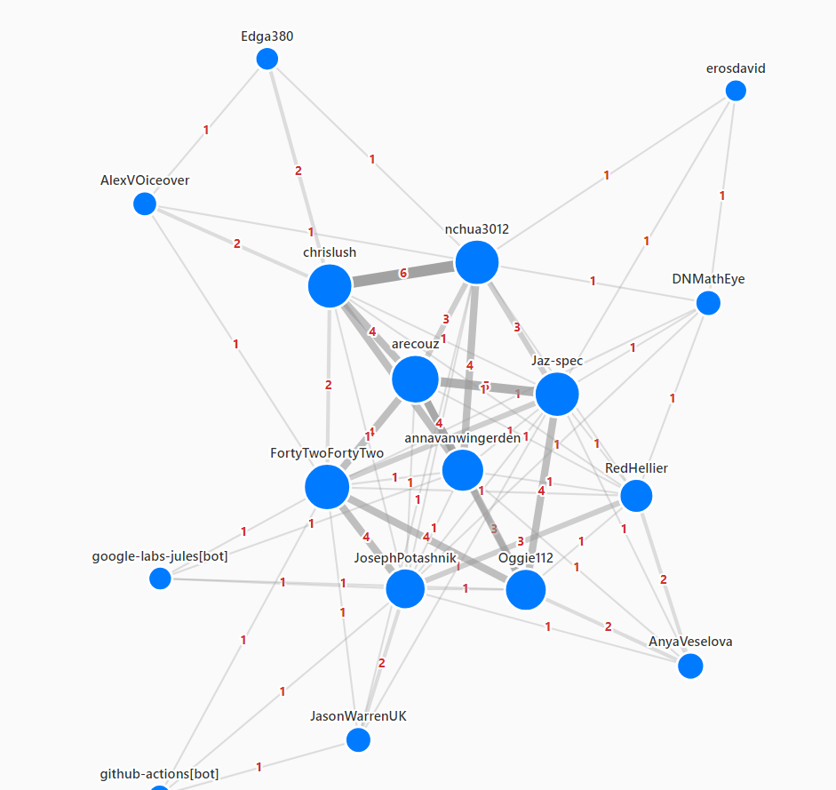
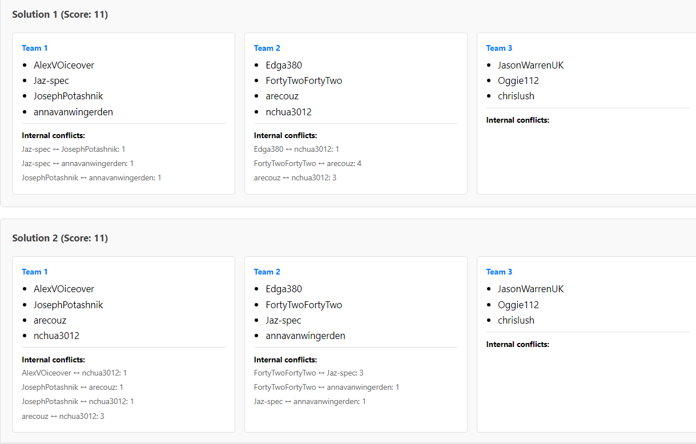

# Team Optimizer

A full-stack application for optimizing team compositions by minimizing overlap from past collaborations.

## Problem

When forming new teams, how do you minimize the number of people who have worked together previously? This ensures fresh collaborations and diverse team dynamics.

## Solution

This application uses **exhaustive search** to find optimal team assignments that minimize historical overlap. It evaluates all possible team combinations and returns the best solutions.

## Features

- **Exhaustive Search Algorithm**: Guaranteed optimal solution for small-to-medium groups (up to ~20 people)
- **Symmetry Breaking Optimization**: Eliminates duplicate partitions, providing 6-120x speedup depending on team configuration
- **Conflict Matrix**: Track how many times each pair has worked together
- **Multiple Solutions**: Returns all equally-optimal assignments
- **Performance Metrics**: Shows combinations checked and execution time
- **Interactive UI**: Two-screen interface with navigation tabs
  - **Collaboration History** (Home): Upload and visualize team history with interactive graph
  - **Optimize Teams**: Select available candidates, configure desired number of teams, run optimization
- **Force-Directed Graph Visualization**:
  - Upload JSON files with team history data
  - Drag-and-drop nodes to reposition contributors
  - Mouse wheel zoom (0.1x to 5x)
  - Click-and-drag background to pan the view
  - Edge thickness and labels show collaboration frequency
  - Node size proportional to total collaborations
  - Toggle labels on/off for cleaner views
  - Regenerate layout button for new force simulation
  - Persistent state across tab navigation

## Technology Stack

### Backend
- **TypeScript**: Type-safe implementation
- **Express**: REST API
- **CORS**: Cross-origin support

### Frontend
- **SvelteKit**: Reactive UI framework
- **TypeScript**: Type-safe components
- **Vite**: Fast development and building

## Quick Start

### Prerequisites
- Node.js 18+
- npm or pnpm

### Installation

```bash
# Install backend dependencies
cd backend
npm install

# Install frontend dependencies
cd ../frontend
npm install
```

### Running the Application

**Terminal 1 - Backend:**
```bash
cd backend
npm run dev
```
Server runs on http://localhost:3001

**Terminal 2 - Frontend:**
```bash
cd frontend
npm run dev
```
UI runs on http://localhost:5173

### Using the Application

#### Collaboration History Screen (Home)

1. Open http://localhost:5173 in your browser
2. Click "Upload Team History" to load a JSON file with historical team data
   - **Example data**: See [frontend/static/fac31-team-data.json](frontend/static/fac31-team-data.json) for a template
   - This example file contains real data harvested from FAC-31 GitHub repositories on 8 November 2025
3. View the interactive graph visualization showing:
   - Contributors as nodes (blue circles)
   - Collaboration frequency as edge thickness and labels
   - Node size proportional to total collaborations
4. Interact with the graph:
   - **Zoom**: Scroll mouse wheel to zoom in/out
   - **Pan**: Click and drag background to move around
   - **Reposition**: Click and drag individual nodes
   - **Toggle Labels**: Use checkbox to show/hide names
   - **Reset View**: Return to default zoom and position
   - **Regenerate Layout**: Run force-directed algorithm again with new random positions


*Interactive force-directed graph showing collaboration frequency between team members*

#### Optimize Teams Screen

1. Navigate to the "Optimize Teams" tab (requires team history data loaded first)
2. Select candidates who are available for the next team composition
   - All team members are selected by default
   - Use checkboxes to deselect unavailable members
   - Use "Select All" / "Deselect All" for bulk operations
3. Configure desired number of teams (e.g., 3, 4, 5)
   - System automatically calculates team sizes to distribute people as evenly as possible
   - Example: 10 people divided into 3 teams → teams of [4, 3, 3]
   - Example: 15 people divided into 4 teams → teams of [4, 4, 4, 3]
4. Click "Optimize Teams" to find the best team assignments
5. View results showing:
   - Minimum conflict score
   - All optimal team configurations
   - Detailed conflict breakdowns per team
   - Performance metrics (combinations checked, execution time)


*Optimization results showing optimal team assignments with minimal conflict scores*

## Using Real FAC-31 Data

This project includes real team history data from the FAC-31 GitHub organization:

### Example Data Template

An example team history file is provided for reference:
- **[frontend/static/fac31-team-data.json](frontend/static/fac31-team-data.json)** - Example data template
  - Contains real data harvested from FAC-31 GitHub repositories on 8 November 2025
  - 17 contributors with complete collaboration history
  - 24 past team compositions
  - Pre-calculated conflict matrix
  - Use this as a template for formatting your own team history data

### Fetching Team History

The [scripts/](scripts/) directory contains tools to fetch and prepare real team data:

```bash
cd scripts
node fetchTeamHistory.js
```

This generates:
- **[fac31-team-data.json](scripts/fac31-team-data.json)** - Complete team history with 15 contributors across 24 past team compositions
- **[candidates.json](scripts/candidates.json)** - Editable list of candidates for next team formation

### Preparing Candidate Data

1. Open [scripts/candidates.json](scripts/candidates.json)
2. Set `"available": false` for anyone who has left the program
3. Update the desired number of teams based on available candidates
4. Use this filtered data in the optimizer

**Current FAC-31 Data:**
- 15 unique contributors (17 including bots)
- 24 past team compositions from GitHub repositories
- Conflict matrix showing collaboration frequencies
- Top collaborations: chrislush & nchua3012 (6 times), arecouz & Jaz-spec (5 times)

## How It Works

### 1. Input Data

**People**: Array of individuals with IDs and names
```typescript
[
  { id: '1', name: 'Alice' },
  { id: '2', name: 'Bob' },
  ...
]
```

**Team Sizes**: Desired composition
```typescript
[3, 3, 3, 3]  // Four teams of 3 people each
```

**Conflict Matrix**: Historical collaborations
```typescript
{
  '1': { '2': 2, '3': 1 },  // Alice worked with Bob 2x, Charlie 1x
  '2': { '1': 2, '4': 2 },  // Bob worked with Alice 2x, Diana 2x
  ...
}
```

### 2. Algorithm

The optimizer uses **exhaustive search with symmetry breaking**:
1. Generates all possible ways to partition people into specified team sizes
2. **Optimization**: When multiple teams have the same size, eliminates duplicate partitions by enforcing canonical ordering (minimum person ID in each team must be ascending)
3. Calculates conflict score for each partition (sum of all pairwise conflicts within teams)
4. Returns the partition(s) with minimum conflict score

**Symmetry Breaking Impact**:
- For 4 teams of size 3: **24x speedup** (reduces 369K combinations to ~15K)
- For 3 teams of size 4: **6x speedup**
- Makes problems up to 20 people feasible with exhaustive search

### 3. Complexity

For 12 people in 4 teams of 3:
- **Naive combinations**: ~369,600
- **With optimization**: ~15,400 (24x reduction)
- **Runtime**: < 1 second
- **Guaranteed**: Optimal solution

## API Reference

### POST /api/optimize

Optimize team assignments.

**Request:**
```json
{
  "people": [
    { "id": "1", "name": "Alice" },
    { "id": "2", "name": "Bob" }
  ],
  "teamSizes": [3, 3],
  "conflictMatrix": {
    "1": { "2": 2 }
  }
}
```

**Response:**
```json
{
  "bestAssignments": [
    {
      "teams": [
        { "members": [{ "id": "1", "name": "Alice" }, ...] }
      ],
      "conflictScore": 15
    }
  ],
  "totalCombinationsChecked": 369600,
  "executionTimeMs": 1234
}
```

### GET /api/health

Health check endpoint.

**Response:**
```json
{ "status": "ok" }
```

## Project Structure

```
team-optimiser/
├── backend/
│   ├── src/
│   │   ├── index.ts           # Express server & API endpoints
│   │   ├── teamOptimizer.ts   # Core optimization algorithm
│   │   └── types.ts           # TypeScript interfaces
│   ├── package.json
│   └── tsconfig.json
│
├── frontend/
│   ├── src/
│   │   ├── routes/
│   │   │   ├── +layout.svelte      # Navigation layout with tabs
│   │   │   ├── +page.svelte        # Collaboration history screen (home)
│   │   │   └── optimize/
│   │   │       └── +page.svelte    # Team optimization screen
│   │   ├── lib/
│   │   │   └── stores/
│   │   │       └── historyStore.ts # Persistent state for graph data
│   │   └── app.html
│   ├── package.json
│   ├── svelte.config.js
│   └── vite.config.ts
│
├── scripts/
│   ├── fetchTeamHistory.js    # Fetch team data from GitHub
│   ├── generateCandidatesList.js  # Create editable candidates list
│   ├── fac31-team-data.json   # Complete FAC-31 team history
│   └── candidates.json        # Editable candidate availability
│
├── PLANNING.md                # Detailed architecture & algorithm docs
└── README.md                  # This file
```

## Development

### Backend Development

```bash
cd backend

# Run with hot reload
npm run dev

# Build for production
npm run build

# Run production build
npm start
```

### Frontend Development

```bash
cd frontend

# Run dev server
npm run dev

# Build for production
npm run build

# Preview production build
npm run preview

# Type checking
npm run check
```

## Performance Considerations

**With symmetry breaking optimization:**

| People | Teams | Optimized Combinations | Expected Time |
|--------|-------|------------------------|---------------|
| 9      | 3×3   | ~47                    | < 1ms         |
| 12     | 4×3   | ~15K                   | < 1s          |
| 15     | 5×3   | ~6.25M                 | 10-60s        |
| 16     | 4×4   | ~2.6M                  | 5-30s         |
| 20     | 5×4   | ~83M                   | 1-10min       |

**Note**: With symmetry breaking, exhaustive search is feasible up to ~20 people. Beyond 20-25 people, heuristic algorithms (simulated annealing, genetic algorithms) may be beneficial for faster results.

## Future Enhancements

See [PLANNING.md](PLANNING.md) for detailed roadmap, including:

- Branch & bound pruning for faster search
- Parallel processing across CPU cores
- Heuristic methods for large groups (20+ people)
- Weighted conflicts (recent collaborations weighted higher)
- Skill balancing and diversity metrics
- Hard constraints and preferred pairings
- ✅ ~~Historical tracking and visualization~~ (Implemented)
- Save/load custom graph layouts
- Export graph as image
- Filter graph by collaboration threshold
- Highlight specific collaboration paths

## Use Cases

1. **Workshop/Training**: Form diverse learning groups
2. **Team Rotations**: Spread knowledge across organization
3. **Project Assignments**: Balance experience and fresh perspectives
4. **Event Planning**: Optimize networking opportunities
5. **Research Collaborations**: Encourage cross-pollination of ideas

## License

MIT

## Contributing

Contributions welcome! Please read [PLANNING.md](PLANNING.md) for architecture details before submitting PRs.

## Questions?

See [PLANNING.md](PLANNING.md) for detailed algorithm explanation and design decisions.
